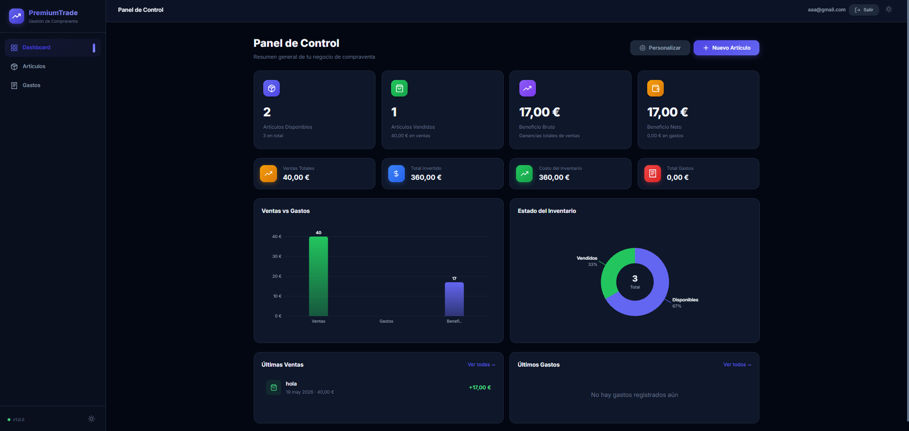
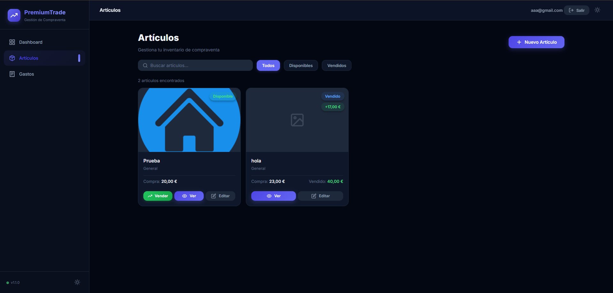
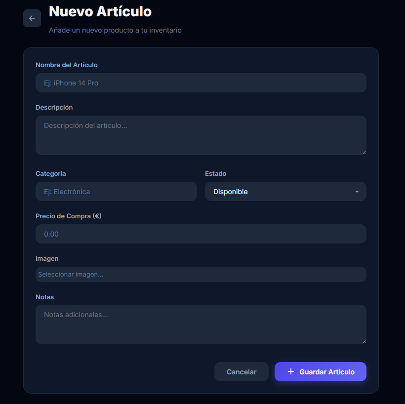
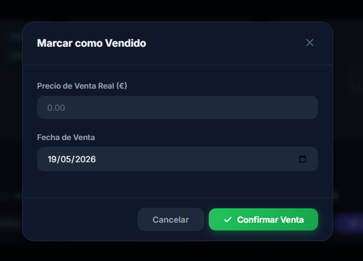
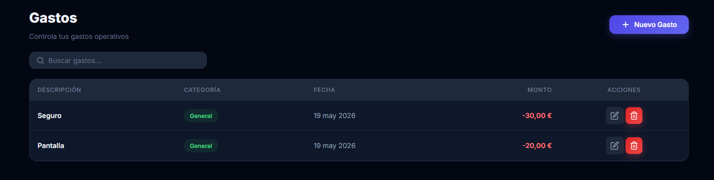
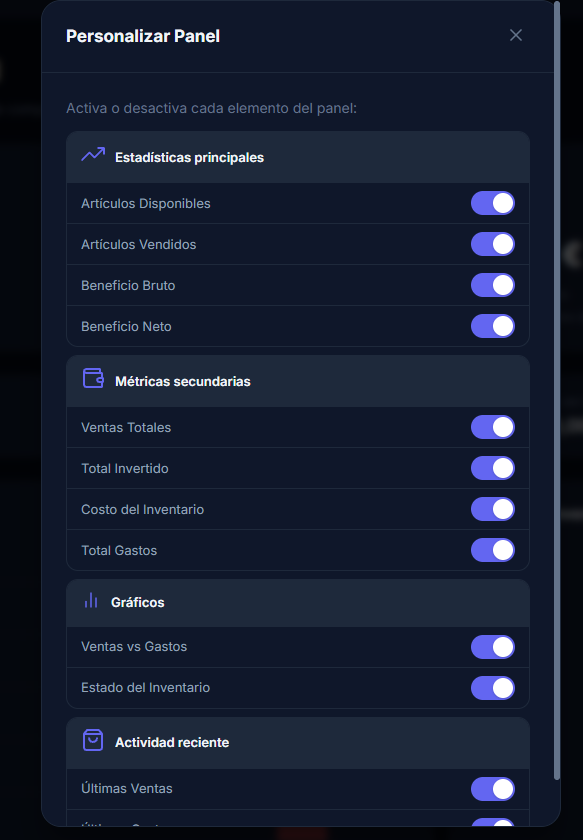
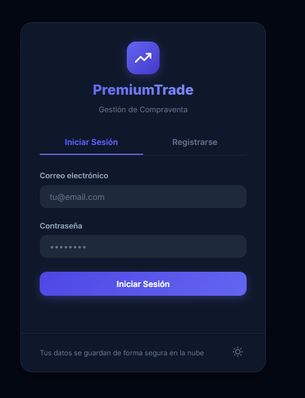
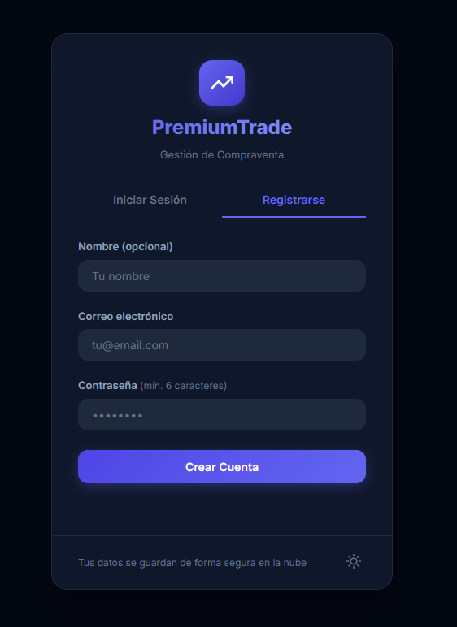
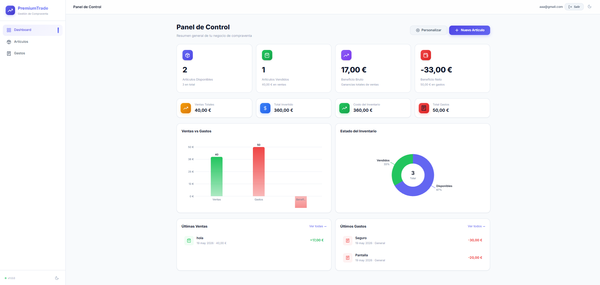
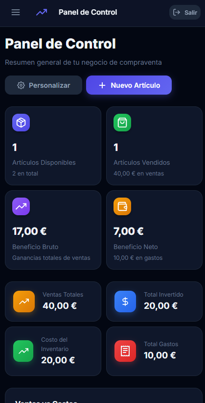

# PremiumTrade - Sistema de Gestión de Inventario

Aplicación web progresiva (PWA) para gestión de inventario, control de gastos y dashboard de ganancias.

🔗 **Demo en vivo:** [https://premiumtradee.web.app](https://premiumtradee.web.app)

---

## 🚀 Características

- 📦 **Inventario completo** — agregar, editar, vender y filtrar productos
- 💰 **Control de gastos** — registrar y categorizar gastos del negocio
- 📊 **Dashboard interactivo** — estadísticas, gráficos (barras y dona), personalizable
- 🔐 **Autenticación** — registro e inicio de sesión con Firebase Auth
- ☁️ **Sincronización en la nube** — datos en Firestore con respaldo en localStorage
- 📱 **PWA** — funciona offline, instalable en el móvil
- 🌓 **Modo oscuro** — alternancia claro/oscuro
- 📱 **Responsive** — adaptado a móvil, tablet y escritorio

---

## 🛠️ Tecnologías

| Tecnología | Uso |
|---|---|
| **HTML5 + CSS3** | Estructura y estilos (variables CSS, flexbox, grid) |
| **JavaScript (Vanilla)** | Lógica de la aplicación, sin frameworks |
| **Firebase Auth** | Autenticación de usuarios |
| **Cloud Firestore** | Base de datos en tiempo real |
| **Firebase Hosting** | Despliegue y alojamiento |
| **Web Crypto API** | Cifrado del lado del cliente |
| **Service Worker** | Funcionamiento offline (PWA) |

---

## 📁 Estructura del proyecto

```
/
├── index.html              # Punto de entrada
├── manifest.json           # Configuración PWA
├── sw.js                   # Service Worker (caché offline)
├── firebase.json           # Configuración de Firebase Hosting
├── firestore.rules         # Reglas de seguridad de Firestore
├── .gitignore
├── css/
│   └── style.css           # Todos los estilos
├── js/
│   ├── firebase-config.js  # Inicialización de Firebase
│   ├── auth.js             # Autenticación (login, registro, logout)
│   ├── db.js               # Capa de persistencia (localStorage + Firestore)
│   ├── app.js              # Enrutador y lógica principal
│   ├── pages.js            # Renderizado de páginas y componentes UI
│   ├── charts.js           # Gráficos (barras y dona) con Canvas API
│   └── icons.js            # Iconos SVG reutilizables
├── icons/                  # Iconos para PWA
└── README.md
```

---

## ⚙️ Cómo ejecutar localmente

1. Clona el repositorio:
   ```bash
   git clone https://github.com/RaaReeS/PremiumTrade.git
   cd PremiumTrade
   ```

2. Abre `index.html` en tu navegador o sirve con un servidor local:
   ```bash
   npx serve .
   ```

3. Para usar tu propio Firebase:
   - Crea un proyecto en [Firebase Console](https://console.firebase.google.com)
   - Habilita **Authentication** (Email/Password) y **Cloud Firestore**
   - Actualiza `js/firebase-config.js` con tu configuración
   - Despliega con `firebase deploy`

---

## 🔒 Seguridad

- Autenticación obligatoria para acceder a los datos
- Reglas de Firestore que aíslan los datos por usuario
- Cada usuario solo puede leer/escribir sus propios productos y gastos
- Cifrado en reposo en los servidores de Google Cloud

---

## 📸 Capturas

| Vista | Descripción |
|---|---|
|  | Panel principal con estadísticas y gráficos |
|  | Listado de inventario con búsqueda y filtros |
|  | Formulario para agregar producto |
|  | Modal para marcar producto como vendido |
|  | Listado y registro de gastos |
|  | Panel de personalización del dashboard |
|  | Pantalla de inicio de sesión |
|  | Pantalla de registro de usuario |
|  | Dashboard en modo claro |
|  | Vista responsive en dispositivo móvil |

---

## 👨‍💻 Autor

**RaaReeS** — [GitHub](https://github.com/RaaReeS)

---

## 📄 Licencia

Este proyecto es de código abierto y fue desarrollado como proyecto portfolio.
